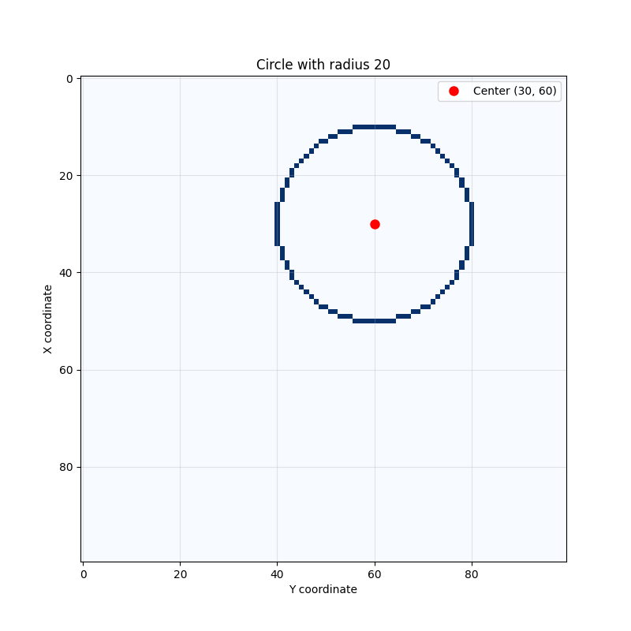

# Paint Circle

A Python program that generates a circle with radius R around a center point (x0, y0) on a matrix M using a recursive algorithm.

## Features

- **Interactive UI**: User-friendly interface to input circle parameters
- **Customizable parameters**: 
  - Radius (1-20)
  - Matrix size (20-100)
  - Center coordinates
- **Multiple output formats**:
  - Text representation using characters
  - Matplotlib visualization
- **Input validation**: Ensures parameters are within valid ranges
- **Error handling**: Graceful handling of invalid inputs

## Example Output



*Example of a circle with radius 5 drawn on a 50x50 matrix*

## Usage

Run the program:
```bash
uv run python circle_test.py
```

The program will guide you through:
1. Entering the radius
2. Setting matrix size  
3. Choosing center coordinates
4. Selecting display method (text, plot, or both)

## Algorithm

The program uses a recursive approach to draw circles by:
1. Starting from a point on the circle perimeter
2. Finding the next best cell based on distance from center
3. Marking cells that are closest to the target radius
4. Continuing until the circle is complete

## Requirements

- Python 3.9+
- numpy
- matplotlib
- pandas (for data science environment)
